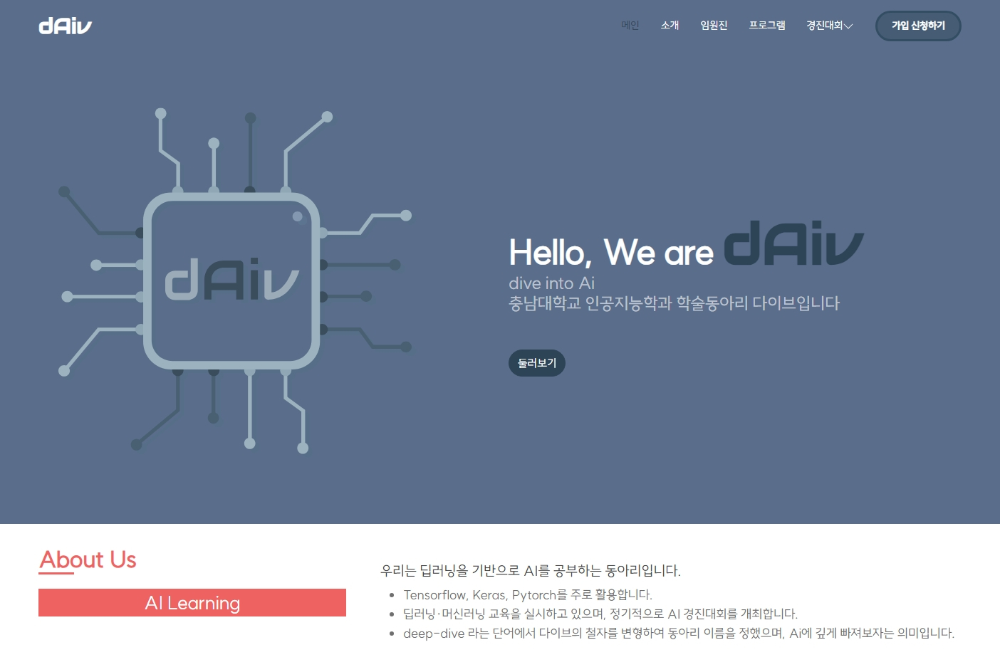

# # Welcome to dAiv's Blog Page! 👋

<pre>
"dive into AI"
> "안녕하세요! 충남대학교 인공지능학과 학술동아리 다이브입니다."
</pre>



---

# # The Page is Built with...

### ✒️ Language / Framework
- Brython (Python on browser) for front-end development
- Flask for back-end development / GitHub Pages for static pages release

### 🪧 How to run the dev page
```shell
python -m flask app.py
```

### 📲 Deploy
- Just git push to GitHub origin so that the jekyll build script can work for distribution.
- Please refer to the [yml](./.github/workflows/jekyll-gh-pages.yml) file to see the deploy settings.